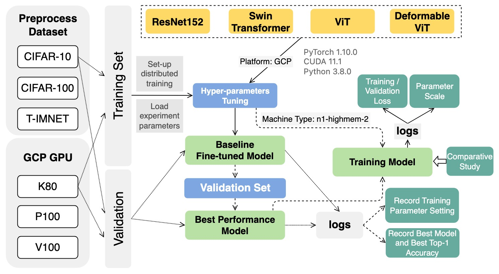
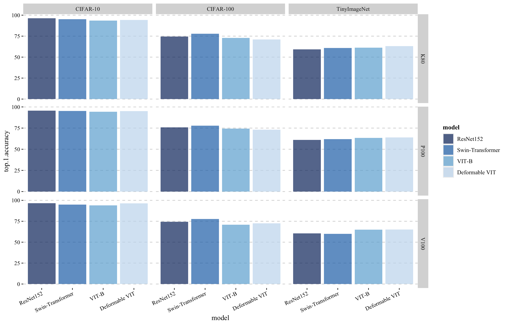
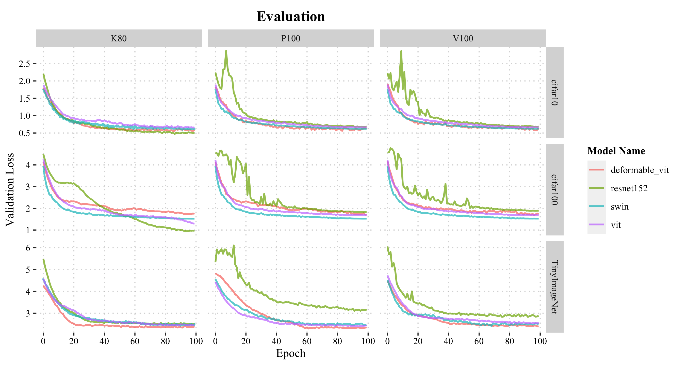

# A comparative study of ViT Based Model on Small Sized Dataset and Deformable ViT 

> Author：Lukas Wang

<!-- logo -->

<br/>

<!-- tag line -->
<h3 align='center'> Performance Comparison of Vision Transformer (ViT) and Deformable Vision Transformer on Small Size Datasets </h3>

<h4 align='center'> Trained on Google Cloud Platform </h4>

<br/>

## 🤔 Goal / Objective

[ViT](https://arxiv.org/abs/2010.11929) is a model proposed by the Google in 2020 to apply Transformer to image classification. Although it is not the first paper applying Transformer to visual tasks, it still became a milestone in the application of transformers in the CV field because of its simplicity and excellent performance. The author concludes that these models provide moderate accuracies that are a few percentage points lower than ResNets of comparable size when trained on small-sized datasets like ImageNet without significant regularization. Transformers may not generalize well when trained on minimal quantities of data because they lack some of the inductive biases present in CNNs, such as translation equivariance and localization, which may explain this seemingly disheartening result. 

[Deformable DETR](https://arxiv.org/abs/2010.04159) introduces Deformable Attention module whose attention modules only attend to a small set of key sampling points around a reference. With the help of the significant areas in the feature maps, the Deformable Attention module can successfully represent the relationships between tokens. The self-attention module may concentrate on pertinent regions and record more valuable characteristics thanks to its adaptable scheme.

Theoretically, ViT’s ability to capture local features will be improved if the Attention module ViT is replaced by the Deformable Attention module. With improvement of locality, will ViT with Deformable Attention module have a better performance than ResNets of comparable size in small-sized datasets? Our objective of this project is to `evaluate the performance of ViT with Deformable Attention module on small and small-sized datasets and compared with original ViT and CNN (ResNets of comparable size)`.


<br/>


## 🔥 Challenges

### *Training Challenge*
- Transformer model always **needs more data to train** than CNN of comparable size in order to converge and reach the optimal performance. Therefore, how to choose `GPUs`, `batch size`, `optimizer`, `learning rate` becomes the challenges.
- When training on images with high resolutions(large size), due to GPU performance limitations, relatively **small batch batch has to be used**.


### *Data-related Challenge*
- Small and medium size datasets are used. In order to **improve model’s generalization ability and prevent overfitting**, following `data augmentation` and `data preprocessing` techniques have been designed.
  - Cutmix
  - Mixup
  - Label-Smoothing
  - Random erasing
  - Rotation 
  - Horizontal Flips


### *Hardware Challenge*
- The performance of VIT model trained by different types of GPUs will be compared. Therefore, how to get different GPUs and how to **choose a stable region in GCP** becomes a challenges, 


<br/>


## ✨ Approaches
ViT’s ability to capture local features will be improved if the Attention module ViT is replaced by the Deformable Attention module.  Firstly, the Attention module ViT is replaced by the Deformable Attention module according to the following equation:
$$\operatorname{DeformAttn}\left(Z_q, p_q, x\right)=\sum_{m=1}^M W_m\left[\sum_{k=1}^K A_{m q k} * W_m^{\prime} x_k\left(p_q+\Delta_{p_{m q k}}\right)\right]$$

Where $Z_q$ is the input feature of $q^{\text {th }}$ query, $\mathbf{M}$ is the set of Multi-head attention, $\boldsymbol{W}_{\boldsymbol{m}}$ is the output projection matrix at $\boldsymbol{m}^{\boldsymbol{t h}}$ head, $\boldsymbol{\Omega}_{\boldsymbol{k}}$ is the set of query, $\boldsymbol{A}_{\boldsymbol{m} \boldsymbol{k}}$ is the attention weight of $\boldsymbol{q}^{\boldsymbol{t h}}$ query to $\boldsymbol{k}^{\boldsymbol{t h}}$ key at $\boldsymbol{m}^{\boldsymbol{t h}}$ head, and $\boldsymbol{W}_{\boldsymbol{m}}^{\prime}$ is the input value projection matrix at $\boldsymbol{m}^{\boldsymbol{t h}}$ head. Deformable attention module is to learn to sample $\mathbf{K}$ key values independently near each reference point. $\boldsymbol{p}_{\boldsymbol{q}}$ represents 2-d coordinate of reference point for $\boldsymbol{q}^{\boldsymbol{t h}}$ query. $\Delta_{\boldsymbol{p}_{\boldsymbol{m q k}}}$ represents sampling offset of $\boldsymbol{q}^{\boldsymbol{t h}}$ query to $\boldsymbol{k}^{\boldsymbol{t h}}$ key at $\boldsymbol{m}^{\boldsymbol{t h}}$ head. Because $\boldsymbol{x}_{\boldsymbol{k}}\left(\boldsymbol{p}_{\boldsymbol{q}}+\Delta_{\boldsymbol{p}_{\boldsymbol{m} \boldsymbol{k}}}\right)$ is fractional, bilinear interpolation is applied.

In order to make a comprehensive comparison between four models (ViT with Deformable Attention module, original ViT, ResNets of comparable size, and swin transformer), three small-size dataset will be used: [CIFAR10](https://www.cs.toronto.edu/~kriz/cifar.html), [CIFAR100](https://www.cs.toronto.edu/~kriz/cifar.html), [Tiny-ImageNet](https://www.image-net.org/). After training, `model information`, `training epochs`, `training time(hours)`, `top-1 accuracy (%)`, `throughput(image/sec)`, `GPU type` will be recorded and make further comparisons.

<br/>

## ⚡ Implementation details

- Platform: Google Cloud Platform
- Software: Pytorch
- Dataset: CIFAR10, CIFAR100, Tiny-ImageNet


### *Dataset*
<table class="center">
    <tbody>
        <tr>
            <td style="text-align: center"> </td>
            <td style="text-align: center">Dataset Size</td>
            <td style="text-align: center">Image Size</td>
            <td style="text-align: center">Number of Classes</td>
        </tr>
        <tr>
            <td style="text-align: center">CIFAR-10</td>
            <td style="text-align: center">60000</td>
            <td style="text-align: center">32x32</td>
            <td style="text-align: center">10</td>
        </tr>
        <tr>
            <td style="text-align: center">CIFAR-100</td>
            <td style="text-align: center">60000</td>
            <td style="text-align: center">32x32</td>
            <td style="text-align: center">100</td>
        </tr>
            <td style="text-align: center">TinyImageNet</td>
            <td style="text-align: center">100000</td>
            <td style="text-align: center">64×64</td>
            <td style="text-align: center">500</td>
        </tr>
    </tbody>
</table>

### *Model Performance on Large Dataset*
<table class="center">
    <tbody>
        <tr>
            <td style="text-align: center"> </td>
            <td style="text-align: center">Params(M)</td>
            <td style="text-align: center">FLOPs(G)</td>
            <td style="text-align: center">ImageNet (large Dataset) Performance</td>
        </tr>
        <tr>
            <td style="text-align: center">ResNet152</td>
            <td style="text-align: center">60.19</td>
            <td style="text-align: center">11.58</td>
            <td style="text-align: center">Top-1 (%): 78.63 Top-5 (%): 94.16</td>
        </tr>
        <tr>
            <td style="text-align: center">VIT-B</td>
            <td style="text-align: center">88.6</td>
            <td style="text-align: center">8.56</td>
            <td style="text-align: center">Top-1 (%): 84.01 Top-5 (%): 97.08</td>
        </tr>
            <td style="text-align: center">Deformable VIT</td>
            <td style="text-align: center">91.5</td>
            <td style="text-align: center">9.02</td>
            <td style="text-align: center">❌</td>
        </tr>
    </tbody>
</table>

> The reson we do not show result of our Deformable VIT is it takes really long time to train and the GCP platform is really unstable and we only have limited time for this project 😭. We plan to test its performance in the future.


### *GPU Type*
- NVIDIA Tesla K80 24GB
- NVIDIA Tesla P100 16 GB
- NVIDIA Tesla V100 32GB
> All provided on [Google Cloud Platform](https://cloud.google.com/compute/docs/gpus).


<br/>


## 🧪 Experiment
We complete the experiment through following flow chart:
<p align="center">
  
</p>

### *Training Stage*
- Training three models from scratch using **three different datasets** and make comparison
- Training three models from scratch using **three different GPUs** and make comparison

### *Evaluating Stage*
We mainly test following three experiment during evaluating stage:
<table class="center">
    <tbody>
        <tr>
            <td style="text-align: center"></td>
            <td style="text-align: center">Same Model</td>
            <td style="text-align: center">Different Models</td>
        </tr>
        <tr>
            <td style="text-align: center">Same Dataset</td>
            <td style="text-align: center">Different GPUs</td>
            <td style="text-align: center">Same GPU</td>
        </tr>
        <tr>
            <td style="text-align: center">Different Datasets</td>
            <td style="text-align: center">Same GPU</td>
            <td style="text-align: center">❌</td>
        </tr>
    </tbody>
</table>
<br/>


## 🌻 Results

### *Top-1 Accuracy*
<table class="center">
    <tbody>
        <tr>
            <td style="text-align: center"> </td>
            <td style="text-align: center">CIFAR-10 K80</td>
            <td style="text-align: center">CIFAR-10 V100</td>
            <td style="text-align: center">CIFAR-10 P100</td>
            <td style="text-align: center">CIFAR-100 K80</td>
            <td style="text-align: center">CIFAR-100 V100</td>
            <td style="text-align: center">CIFAR-100 P100</td>
            <td style="text-align: center">TinyImageNet K80</td>
            <td style="text-align: center">TinyImageNet V100</td>
            <td style="text-align: center">TinyImageNet P100</td>
        </tr>
        <tr>
            <td style="text-align: center">ResNet152</td>
            <td style="text-align: center">96.37</td>
            <td style="text-align: center">96.63</td>
            <td style="text-align: center">95.56</td>
            <td style="text-align: center">74.52</td>
            <td style="text-align: center">74.44</td>
            <td style="text-align: center">75.85</td>
            <td style="text-align: center">59.2</td>
            <td style="text-align: center">60.5</td>
            <td style="text-align: center">61.1</td>
        </tr>
        </tr>
            <td style="text-align: center">Swin Transformer</td>
            <td style="text-align: center">95.18</td>
            <td style="text-align: center">94.99</td>
            <td style="text-align: center">95.18</td>
            <td style="text-align: center">77.94</td>
            <td style="text-align: center">77.63</td>
            <td style="text-align: center">77.79</td>
            <td style="text-align: center">60.93</td>
            <td style="text-align: center">59.93</td>
            <td style="text-align: center">61.87</td>
        </tr>
        <tr>
            <td style="text-align: center">VIT-B</td>
            <td style="text-align: center">93.63</td>
            <td style="text-align: center">93.94</td>
            <td style="text-align: center">94.33</td>
            <td style="text-align: center">72.92</td>
            <td style="text-align: center">70.88</td>
            <td style="text-align: center">74.43</td>
            <td style="text-align: center">61.2</td>
            <td style="text-align: center">64.9</td>
            <td style="text-align: center">63.4</td>
        </tr>
            <td style="text-align: center">Deformable VIT</td>
            <td style="text-align: center">94.25</td>
            <td style="text-align: center">96.35</td>
            <td style="text-align: center">94.97</td>
            <td style="text-align: center">71.04</td>
            <td style="text-align: center">72.52</td>
            <td style="text-align: center">73.11</td>
            <td style="text-align: center">63.2</td>
            <td style="text-align: center">65.2</td>
            <td style="text-align: center">63.9</td>
        </tr>
    </tbody>
</table>
<p align="center">
  
</p>

### *Validation Loss*

<p align="center">
  
</p>

<br/>


## 📖 Conclusion
1. The performance of VIT is a few percentage lower than the performance of  ResNets which has less parameters especially when trained on small-sized datasets due to low locality inductive bias in VIT.
2. The Deformable Attention Module can mitigate the problem of low locality inductive bias in VIT especially on small-size dataset and reduce the Transformer’s heavy dependence on a large dataset.
3. For the small size dataset which has more classes and less samples per class, The performance of deformable VIT is worse than the performance of VIT and ResNet due to the higher model complexity of deformable VIT.
4. The types and performances of GPUs have more influences on the training results and performances of Transformers models than CNNs models.

<br/>

## 💻 How to train models
We build a pipeline for you to rebuild the experiment we set with:
```bash
python main.py --model [Model Name] --dataset [Dataset Name] 
```
### ResNet Baseline
```bash
python main.py --model resnet 
```
### Pure ViT
```bash
python main.py --model vit 
```
### Deformable ViT
```bash
python main.py --model deformvit
```

<br/>

## 👽 Future Work
- Train Deformable VIT on large size datasets(e.g ImageNet) and compared to the performance of VIT model.
- Compare the performance of Deformable VIT with other Transformer models(Swin, PiT).
- Research on how different numbers of GPUs will influence the trained performances of Transformers models. 

<br/>